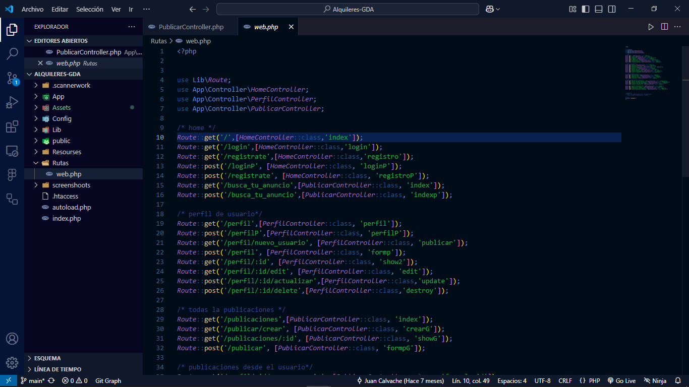

# Mi Microframework en PHP

Este es un microframework desarrollado en PHP puro, creado con el objetivo de entender a profundidad conceptos como POO, MVC, ORMs, SQL, enrutamiento y paginación.

## Capturas de pantalla
Aquí algunas capturas del microframework en acción:

## Características
- Arquitectura MVC
- Enrutamiento dinámico
- Conexión a base de datos con un ORM básico 
- Paginación de resultados

## Uso
- Las rutas se definen en `Rutas/web.php`
- Los controladores están en `App/Controller/`
- Las vistas están en `Resources/View/`
- La configuración de la base de datos está en `Config/database.php`

## Contribución
Este proyecto fue creado con fines educativos en mi ultimo semestre universitario, pero cualquier sugerencia o mejora es bienvenida.

## Autor
Desarrollado por Juan Calvache
